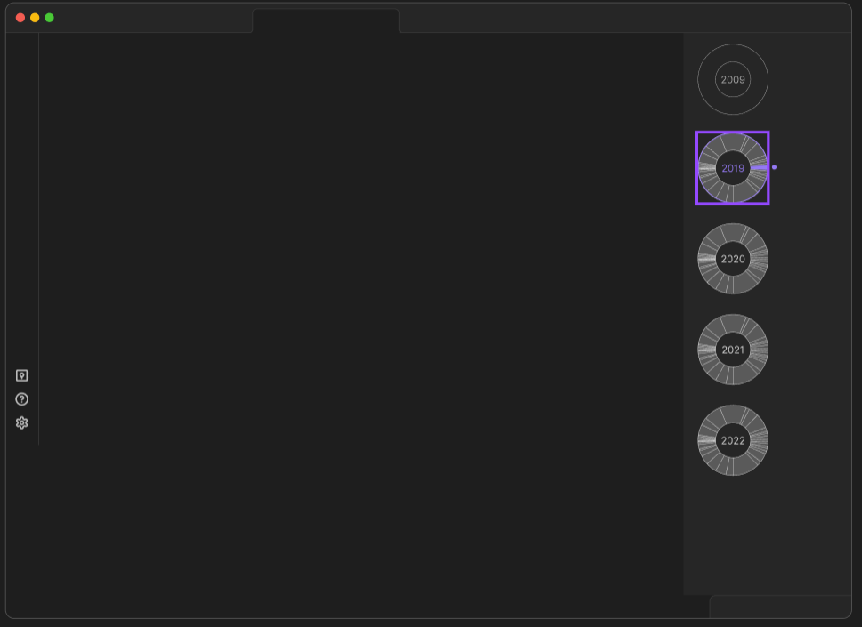
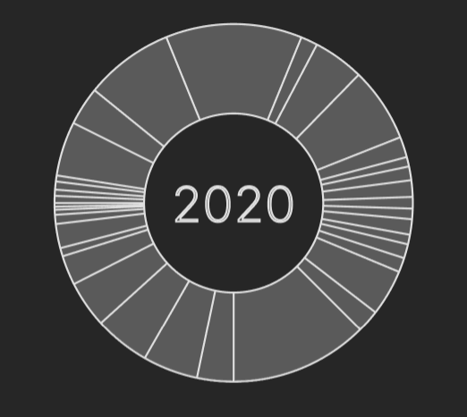
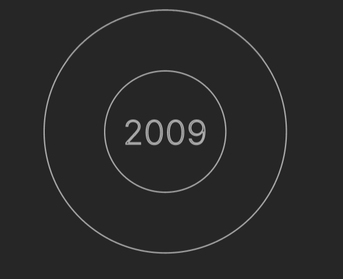
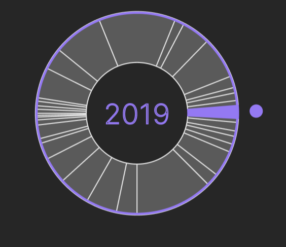

# Phase 0: Requirements

## Vision

Journaling with the daily notes in Obsidian is a great tool to improve your relationship with yourself.  Scrolling through the past entries throughout the past several years works okay. 

I want to create a visualization plugin of what year and month you were writing in. This could help the user have more context in what time of their life they were writing some entry in.

## What should it look like?

The right sidebar should have an icon you can click on and it would then display the timeline

The timeline will be a column of circles. Each circle represents a year. Each year will be a pie chart of Daily notes. The position around the circle correponds to when during the year the note was. If the note was during January it will be at 12:00 and February will be to the right of that etc.

The selected year will have a interactive accent color around the circle, and filled in the time slice. There will be a small purple circle floating adjacent to the slice to emphasize the selected time slice.

**Too many time slice problem:**
If the circle has too many time slices to display well, we will group several notes into the same time slice. On click of the time slice just pull up a random note from that slice.  I am not positive about this solution but it seems the best for now.

I am not so sure about the size of the circles. Ideally I would want an option to zoom in or out.

 

## Building the project

**Data used by the program**
- Location of Daily Notes Directory
    - All daily notes titles
    - Format of daily note title ("YYYY-MM-DD")
- Current file open

**What I already know how to do.**
- Querey files
- Research documentation

**Challenges I foresee.**
- making the circle 
- formatting for mobile
- understanding when obsidian loads the plugin
- learning the obsidian API

## Phase 1: Design

- get the data we need
- check if the display is needed
    - display the thing

- `mainscript.ts`
    - load the timeline
    - bind the view to a button
- `view.ts` 
    - Input: daily note data. Output: timeline

